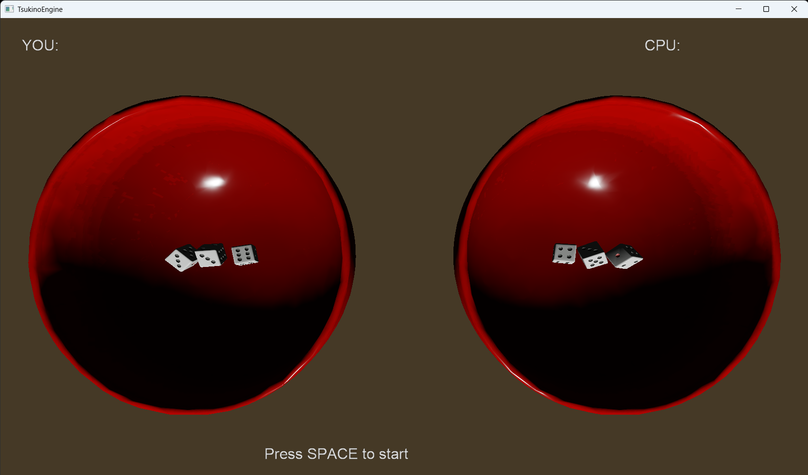

# Cee-lo



🇯🇵 [日本語版はこちら / Japanese version here](README.ja.md)

A dice game built with **TsukinoEngine**, a custom C++ / DirectX 11 game engine.

## About

Cee-lo (known as チンチロ / *Chinchiro* in Japan) is a 1-on-1 dice game played against a CPU opponent. Each player has their own bowl and shakes three dice at once. There's no chip/betting system — it's a single round, and pressing <kbd>Space</kbd> reloads the scene for a rematch.

This project also serves as a showcase/demo game for [TsukinoEngine](https://github.com/tsukinokun/TsukinoEngine), the custom engine it's built on.

## Game Rules

Players may reroll up to 3 times if their dice don't form a scoring hand; failing all 3 rolls is an automatic loss. Hands, from strongest to weakest:

| Hand | Dice | Description |
|---|---|---|
| Pinzoro (ピンゾロ) | 1-1-1 | Highest hand |
| Arashi (アラシ) | Any triple (2-2-2 … 6-6-6) | Three of a kind (excluding 1s) |
| Shigoro (シゴロ) | 4-5-6 | Fixed straight |
| Me (目) | Pair + 1 die | Ranked by the value of the odd die |
| No hand (目なし) | Anything else | Loses / triggers a reroll |

## Tech Stack

- **Language:** C++20
- **Build system:** [Premake5](https://premake.github.io/)
- **Graphics:** DirectX 11
- **ECS:** [EnTT](https://github.com/skypjack/entt)
- **Physics:** [Jolt Physics](https://github.com/jrouwe/JoltPhysics)
- **Platform:** Windows (x64) only
- NuGet packages: `directxtk_desktop_win10`, `AssimpCpp`

## Project Structure

```
CeeLo/                    Game project
├─ src/Scene/              Main game scene (ChinchiroScene)
├─ src/Chinchiro/System/   ECS systems (dice rolling, hand judging, CPU AI, turn rules, ...)
├─ Assets/Models/          Bowl & dice meshes
└─ Assets/Prefabs/         JSON prefabs (camera, lighting, dice, players, ...)

External/TsukinoEngine/   Custom game engine (git submodule)
```

## Getting Started

### Prerequisites

- Windows
- Visual Studio 2022
- A DirectX 11-capable GPU

### Build & Run

1. Clone the repository with submodules:
   ```
   git clone --recurse-submodules https://github.com/tsukinokun/cee-lo.git
   ```
   (If you already cloned without `--recurse-submodules`, run `git submodule update --init --recursive` instead.)
2. Run `open.bat` at the repository root. This generates a Visual Studio 2022 solution (`.build/CeeLo.sln`) via Premake5 and opens it.
3. In Visual Studio, build and run the `CeeLo` startup project (NuGet packages restore automatically).

## Author

**Tsukino** (Ai Yamazaki / 山﨑 愛)

- GitHub: [@tsukinokun](https://github.com/tsukinokun)
- Qiita: [@tsukino_](https://qiita.com/tsukino_)
